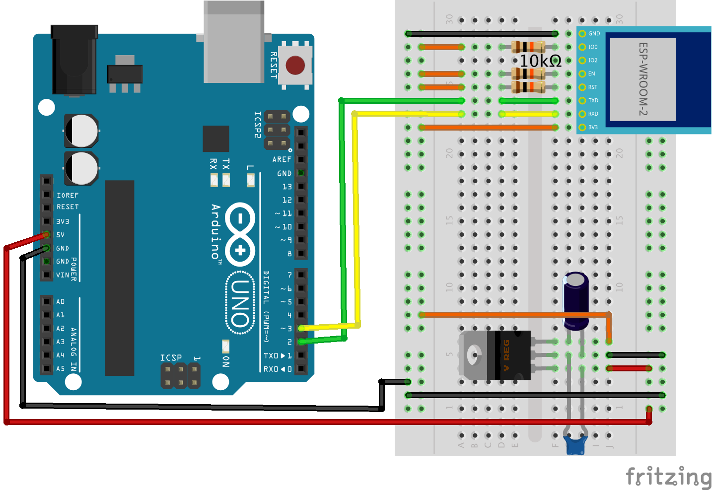

# wifi_esp-wroom-02

## 回路図

|3.3v|5.0v|
|---|---|
|||

## パーツ一覧

|パーツ|個数|3.3v|5.0v|
|---|---|---|---|
|[ESP-WROOM-02 Wi-Fiモジュール](https://www.switch-science.com/catalog/2346/)|1|:white_check_mark:|:white_check_mark:|
|10kΩ 抵抗|3|:white_check_mark:|:white_check_mark:|
|[【I-00538】低損失三端子レギュレーター 3.3V 500mA TA48M033F(S Q)](http://akizukidenshi.com/catalog/g/gI-00538/)|1|:heavy_minus_sign:|:white_check_mark:|

